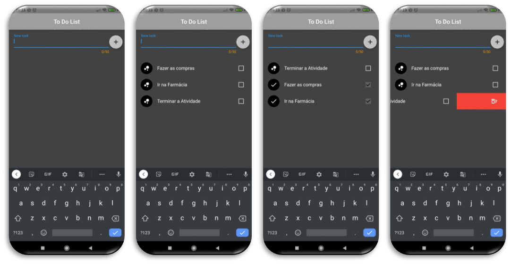

<h1 align="center">
    
</h1>

  <a href="#-tecnologias">Tecnologias</a>&nbsp;&nbsp;&nbsp;|&nbsp;&nbsp;&nbsp;
  <a href="#-funcionalidades">Funcionalidades</a>&nbsp;&nbsp;&nbsp;|&nbsp;&nbsp;&nbsp;
  <a href="#-layout">Layout</a>&nbsp;&nbsp;&nbsp;|&nbsp;&nbsp;&nbsp;
  <a href="speech_balloon-contatos">Contatos</a>

    
    

  Projeto desenvolvido e atrelado com a disciplina de "Aplicações Mobile" da UNINOVE, ministrada pelo Profº Edson, onde o mesmo tem por seu objetivo organizar e controlar tarefas a serem realizadas, como por exemplo "Formatar notebook" ou "Comprar memória". 

 

<!-- LINGUAGENS -->
## 🚀 Tecnologias
Esse projeto foi desenvolvido com as seguintes tecnologias:

- `Desenvolvimento` 
                    

- `Ferramentas` 
                
              
- `Versionamento` 
                  

<!-- REQUISITOS DO SISTEMA -->
## 🛠 Funcionalidades
- `Inserir Tarefa` | Inserir uma tarefa a ser realizada no campo informado (até 50 caracteres);
- `Salvar Tarefa` | Salvar a tarefa e automaticamente irá para a lista abaixo;
- `Marcar (realizado)` | Marcar o "check" ao lado da tarefa para constar tarefa realizada;
- `Desmarcar (não realizado)` | Retirar o "check" ao lado da tarefa para constar tarefa ainda não realizada;
- `Excluir Tarefas` | Excluir a tarefa arrastando a mesma para o lado;

<!-- LAYOUT DO SISTEMA -->
## 💻 Layout
Você pode visualizar abaixo o layout básico do projeto, onde temos nas imagens: 1. como o aplicativo abre (vazio); 2. tarefas inseridas; 3. tarefas marcadas como realizadas ou não realizadas; 4. excluindo uma tarefa do aplicativo.

    

 

<!-- AUTOR  -->
## :busts_in_silhouette: Autor
[    Higor Rocha ](https://github.com/HigorRoc)  Aluno/Desenvolvedor | [    Edson Souza](https://github.com/EdsonMSouza)  Professor/Orientador |
| :---: | :---: |  

<!-- CONTATOS -->
## :speech_balloon: Contatos
&nbsp;
&nbsp;

---

Copyright ©️ 2021 - ToDoList
